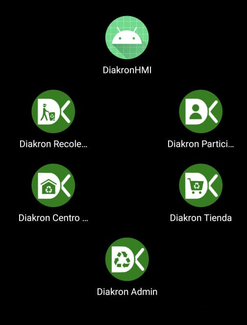

# Diakron


## Project Summary

|                    |                                 |
| ------------------ | ------------------------------- |
| Developers         | 2                               |
| Architecture       | IoT + Embedded + Cloud + Mobile |
| Firmware           | ESP32-CAM (C/C++, PlatformIO)   |
| Backend            | Node.js + WebSockets            |
| Database           | PostgreSQL + Supabase + PostGIS |
| Mobile Apps        | 5 Flutter applications          |
| Payments           | Mercado Pago                    |
| Maps & Geolocation | MapBox + Geofencing             |

## Problem

The Guadalajara Metropolitan Area recycles only a small fraction of its waste due to poor separation at the source. 

## Solution description

Diakron was designed to automate waste classification and incentivize recycling through a gamified circular-economy ecosystem. Diakron is based on smart bins that automatically sort the garbage in categories using
  - Capacitive sensor
  - Inductive sensor
  - ESP32CAM connected to a computer vision model in Hugging Face.

We offer 5 cross-platform mobile applications to integrate a circular waste management system, one for each user role:
  - Participants (users who use the bins and receive points as a reward, they can redeem the points for benefits in aligned business, stores, restaurants, etc.).
  - Stores (users who offer benefits like discount coupons to participants)
  - Collectors (users who collect the classified waste in bins and transport to recycling centers)
  - Collection/Recycling centers (users who receive collectors with waste and buy the classified materials)

## Table of Contents

- [Diakron](#diakron)
  - [Project Summary](#project-summary)
  - [Problem](#problem)
  - [Solution description](#solution-description)
  - [Table of Contents](#table-of-contents)
  - [Demo](#demo)
  - [Architecture](#architecture)
  - [Features](#features)
  - [Repository Structure](#repository-structure)
  - [Tech Stack](#tech-stack)
    - [Firmware](#firmware)
    - [Backend](#backend)
    - [Mobile apps](#mobile-apps)
  - [Hardware](#hardware)
    - [Components](#components)
    - [Electronic board](#electronic-board)
    - [Nema moving test](#nema-moving-test)
    - [Smart bin look](#smart-bin-look)
  - [My Contribution](#my-contribution)
  - [Technical Challenges](#technical-challenges)
    - [Limited GPIO Availability](#limited-gpio-availability)
    - [Material Detection Reliability](#material-detection-reliability)
    - [Thermal Constraints](#thermal-constraints)
    - [Wifi Signal](#wifi-signal)
    - [Ilumination](#ilumination)
  - [Security Considerations](#security-considerations)
  - [Results](#results)
  - [Lessons Learned](#lessons-learned)
  - [Future Improvements](#future-improvements)

## Demo


<table>
  <tr>
    <td></td>
    <td></td>
  </tr>
</table>

## Architecture


ESP32-CAM captures an image of the deposited material and sends it to the Node.js backend through WebSockets.

The backend forwards the image to a Hugging Face computer vision model for classification.

The classification result is combined with readings from capacitive and inductive sensors, allowing the firmware to determine the final material category before actuating the sorting mechanism.

HMI Android is a native mobile app written in Java to interact with ESP32-CAM via a Human-Machine-Interface, it shows which material type has been detected, bins filling levels, and QR codes to earn points (participants) and open the classified material locked bins (collectors).

The Mobile apps can fetch data directly from Database and make QR codes generation and verification through Node.js server.

## Features

- Automatic waste classification (plastic, paper/cardboard, metal, glass)
- ESP32-CAM firmware with sensor fusion
- Computer vision via Hugging Face TrashNet
- Real-time IoT communication
- QR-based reward system
- Geolocation and smart collection routing
- Gamified recycling incentives
- Role-based mobile applications
- Cross-platform apps on Flutter following MVVM pattern

## Repository Structure
```bash
Diakron
├── backend (Node.js server)
├── docs 
│   ├── core
│   ├── diagrams
│   ├── hardware
│   └── screenshots
├── firmware
│   ├── android-HMI (Android Native app)
│   └── esp32cam (embedded C/C++)
└── mobile (Flutter apps)
    ├── admin
    ├── collection-center
    ├── collector
    ├── participant
    └── store

```
## Tech Stack

### Firmware
- PlatformIO
- C/C++
- Android Studio (Java) for HMI

### Backend
- Supabase
- PostgreSQL
- JavaScript with Node.js
- Hugging Face
- Render.com
- Firebase (for push notifications)

### Mobile apps
- Flutter
- Mercado Pago
- MapBox

## Hardware

### Components

- ESP32-CAM
- Capacitive sensor
- Inductive sensor
- NEMA 17 stepper motor
- MG90S servo motor
- Android Tablet (HMI display)

### Electronic board


### Nema moving test

<video controls src="docs/videos/nema-test.mp4" title="Electronic board (Nema moving test)"></video>

### Smart bin look


## My Contribution

- Designed and developed Flutter mobile applications logic with MVVM
- Implemented Mercado Pago Checkout Pro on Admins and Collection Center Flutter apps.
- Designed and developed Node.js endpoints for Mercado Pago authentication, QR generation/verification, and connecting ESP32-CAM with HuggingFae
- Designed base system of communications from ESP32-CAM to HMI and ESP32-CAM to Node.js
- Designed and developed Supabase Row Level Security, Functions, Authentication, Password recovery
- Designed and developed QRs structure and signature with ED25519 algorithm

## Technical Challenges

### Limited GPIO Availability

The ESP32-CAM exposes only a limited number of 10 usable GPIO pins, we used three MCP23017 I2C 16-pins expansors to obtain 48 more digitals pins.

### Material Detection Reliability

Capacitive and inductive sensors require close proximity (~0.8 mm) to materials, reducing classification reliability when objects are irregularly shaped.

### Thermal Constraints

The NEMA 17 stepper motor experienced significant temperature increases during intensive operation, requiring optimization of duty cycles and movement patterns.

### Wifi Signal

The ESP32-CAM wifi signal receptions is low, the wireless router must be max 5 meters of distance of ESP32-CAM

### Ilumination

To obtain the best images for the AI ​​model, we set up controlled lighting using 12V white LEDs

## Security Considerations

- QR signatures implemented using ED25519.
- Row-Level Security (RLS) enforced through Supabase.
- Authentication and authorization managed through role-based access controls.

## Results

- Integration tests achieved 87.5% average classification accuracy for plastic, paper/cardboard, metal, and glass in controlled environments.
- Successfully earned points by scanning QR.
- 

## Lessons Learned

- QR security and avoid users tricks
- Client-server communication
- Concurrent user handling
- Git workflow coordination

## Future Improvements

- Improve ESP32-CAM code simplicity
- Improve esp32 signal reception (with antennas for 2.4GHz band)
- Implement a only e-mail can have many roles (one email for many applications)
- Make MVVM cleaner
- Monorepo with Melos
- Add parameters and bins to classify other materials like electronics, batteries, wood, textiles, organics, etc
- Treat Collectors users like employees with incentives for each collections