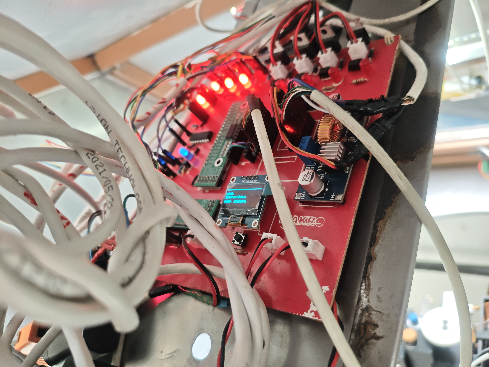
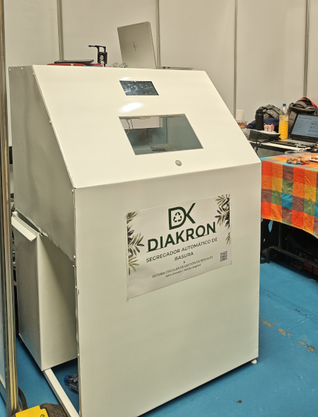
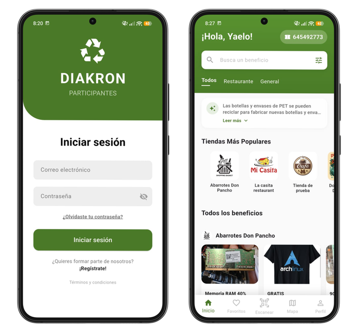
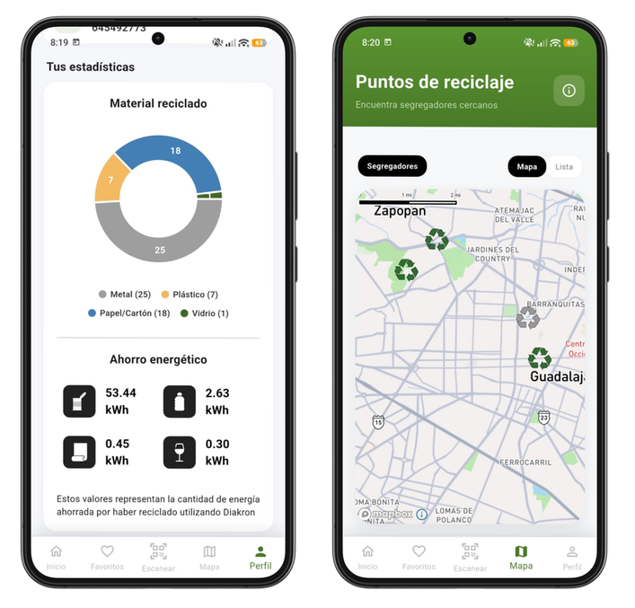
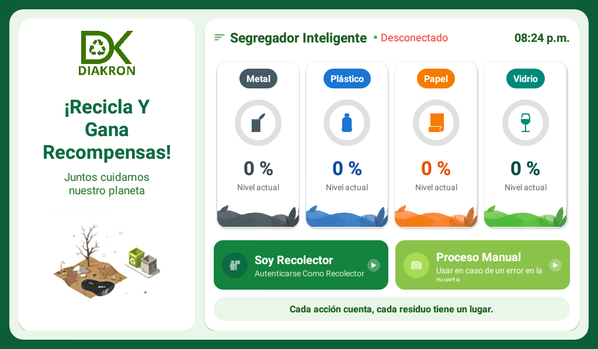
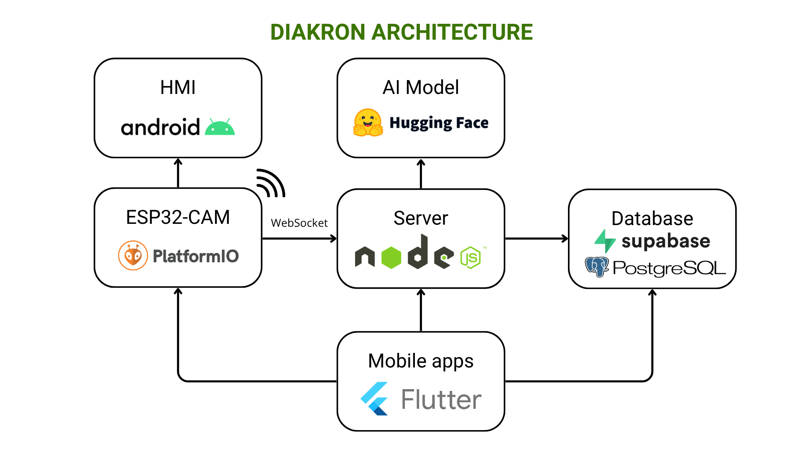

# Diakron


## Project Summary

| Feature | Description |
| :--- | :--- |
| **Developers** | 2 |
| **Architecture** | IoT + Embedded + Cloud + Mobile |
| **Firmware** | ESP32-CAM (C/C++, PlatformIO) |
| **Backend** | Node.js + WebSockets |
| **Database** | PostgreSQL + Supabase + PostGIS |
| **Mobile Apps** | 5 Flutter applications |
| **Payments** | Mercado Pago |
| **Maps & Geolocation** | MapBox + Geofencing |

## Problem

The Guadalajara Metropolitan Area recycles only a small fraction of its waste due to poor separation at the source.

## Solution Description

Diakron was designed to automate waste classification and incentivize recycling through a gamified circular-economy ecosystem. Diakron is based on smart bins that automatically sort the garbage into categories using:
  - Capacitive sensors
  - Inductive sensors
  - An ESP32-CAM connected to a computer vision model hosted on Hugging Face.

We offer 5 cross-platform mobile applications to integrate a circular waste management system, tailored for each user role:
  - **Participants:** Users who deposit waste into the bins and receive reward points, which can be redeemed for benefits at partnered businesses (stores, restaurants, etc.).
  - **Stores:** Partners who offer benefits, such as discount coupons, to participants.
  - **Collectors:** Users who collect the classified waste from the bins and transport it to recycling centers.
  - **Collection/Recycling Centers:** Facilities that receive the collectors and purchase the classified materials.

## Table of Contents

- [Diakron](#diakron)
  - [Project Summary](#project-summary)
  - [Problem](#problem)
  - [Solution Description](#solution-description)
  - [Table of Contents](#table-of-contents)
  - [Demo](#demo)
    - [Electronic board](#electronic-board)
    - [Nema moving test](#nema-moving-test)
    - [Smart bin look](#smart-bin-look)
    - [Participants Login \& Coupons Catalog](#participants-login--coupons-catalog)
    - [Participants Metrics \& Map](#participants-metrics--map)
    - [HMI Android Tablet](#hmi-android-tablet)
  - [Architecture](#architecture)
  - [System Flow](#system-flow)
  - [Features](#features)
  - [Repository Structure](#repository-structure)
  - [Tech Stack](#tech-stack)
    - [Firmware](#firmware)
    - [Backend](#backend)
    - [Mobile apps](#mobile-apps)
  - [Hardware](#hardware)
    - [Components](#components)
  - [My Contribution](#my-contribution)
  - [Technical Challenges](#technical-challenges)
    - [Limited GPIO Availability](#limited-gpio-availability)
    - [Material Detection Reliability](#material-detection-reliability)
    - [Thermal Constraints](#thermal-constraints)
    - [Wifi Signal](#wifi-signal)
    - [Ilumination](#ilumination)
  - [Security Considerations](#security-considerations)
  - [Results](#results)
  - [Lessons Learned](#lessons-learned)
  - [Future Improvements](#future-improvements)

## Demo


### Electronic board



### Nema moving test


### Smart bin look



### Participants Login & Coupons Catalog



### Participants Metrics & Map


### HMI Android Tablet


## Architecture


The ESP32-CAM captures an image of the deposited material and sends it to the Node.js backend via WebSockets. The backend forwards the image to a Hugging Face computer vision model for classification.

The classification result is combined with readings from the capacitive and inductive sensors, allowing the firmware to determine the final material category before actuating the sorting mechanism.

The HMI Android application is a native mobile app written in Java that interacts with the ESP32-CAM via a Human-Machine Interface. It displays the detected material type, bin filling levels, and QR codes to earn points (for participants) or open the locked classified material bins (for collectors).

The mobile apps fetch data directly from the database and handle QR code generation and verification through the Node.js server.

## System Flow

1. User deposits waste.
2. ESP32-CAM captures an image.
3. Image is sent to the backend.
4. Hugging Face classifies the material.
5. Sensor data validates the AI classification.
6. Material is routed to the corresponding bin.
7. User receives reward points.
8. Points can be redeemed in partner stores.

## Features

- Automatic waste classification (plastic, paper/cardboard, metal, glass).
- ESP32-CAM firmware with sensor fusion.
- Computer vision via Hugging Face TrashNet.
- Real-time IoT communication (WebSockets).
- QR-based reward system.
- Geolocation and smart collection routing.
- Gamified recycling incentives.
- Role-based cross-platform mobile applications in Flutter following the MVVM architectural pattern.

## Repository Structure
```text
Diakron
├── backend (Node.js server)
├── docs 
│   ├── core
│   ├── diagrams
│   ├── hardware
│   └── screenshots
├── firmware
│   ├── android-HMI (Android Native app)
│   └── esp32cam (embedded C/C++)
└── mobile (Flutter apps)
    ├── admin
    ├── collection-center
    ├── collector
    ├── participant
    └── store

```
## Tech Stack

### Firmware
- PlatformIO
- C/C++
- Android Studio (Java) for HMI

### Backend
- Supabase
- PostgreSQL
- JavaScript with Node.js
- Hugging Face
- Render.com
- Firebase (for push notifications)

### Mobile apps
- Flutter
- Mercado Pago
- MapBox

## Hardware

### Components

- ESP32-CAM
- Capacitive sensor
- Inductive sensor
- NEMA 17 stepper motor
- MG90S servo motor
- Android Tablet (HMI display)

## My Contribution

- Architected and developed the Flutter mobile applications' logic using the MVVM pattern.
- Implemented Mercado Pago Checkout Pro within the Admin and Collection Center Flutter apps.
- Designed and developed Node.js endpoints for Mercado Pago authentication, QR generation/verification, and connecting the ESP32-CAM with the Hugging Face API.
- Engineered the base communication systems (ESP32-CAM to HMI, and ESP32-CAM to Node.js via WebSockets).
- Designed and implemented Supabase Row-Level Security (RLS) policies, PostgreSQL functions, authentication processes, and password recovery.
- Designed and developed the QR code structure and cryptographic signatures using the ED25519 algorithm.

## Technical Challenges

### Limited GPIO Availability

The ESP32-CAM exposes only 10 usable GPIO pins. We overcame this by integrating three MCP23017 I2C 16-pin expanders, providing an additional 48 digital pins.

### Material Detection Reliability

Capacitive and inductive sensors require close proximity (~0.8 mm) to materials, which reduced classification reliability for irregularly shaped objects.

### Thermal Constraints

The NEMA 17 stepper motor experienced significant temperature increases during intensive operation, requiring optimization of duty cycles and movement patterns.

### Wifi Signal

The ESP32-CAM's onboard Wi-Fi antenna has low reception gain, requiring the instalation of a stronger antenna and the wireless router to be positioned within a maximum distance of 5 meters.

### Ilumination

To obtain high-quality images for the AI model, we established a controlled lighting environment inside the system using 12V white LEDs.

## Security Considerations

- QR signatures implemented using the ED25519 cryptographic algorithm.
- Row-Level Security (RLS) enforced directly at the database level via Supabase.
- Authentication and authorization managed through strict role-based access controls.

## Results

- Integration tests achieved an 87.5% average classification accuracy for plastic, paper/cardboard, metal, and glass in controlled environments.
- Successfully demonstrated the full gamification loop, allowing users to earn points by scanning dynamically generated QR codes.

## Lessons Learned

- Implementing secure QR generation and preventing user exploitation/fraud.
- Managing robust client-server communications over WebSockets.
- Handling concurrent users and database race conditions.
- Coordinating code integration using a structured Git workflow.

## Future Improvements

- Refactor and optimize the ESP32-CAM C/C++ codebase for better memory management.
- Improve ESP32 signal reception by upgrading to an external 2.4GHz IPEX antenna.
- Allow a single user email address to support multiple roles across the ecosystem.
- Refine the MVVM implementation in Flutter for cleaner state management.
- Migrate the repository to a monorepo architecture using Melos.
- Add hardware parameters and bins to classify additional materials (e-waste, batteries, wood, textiles, organics).
- Treat "Collector" users as employees, implementing collection-based monetary incentives.
